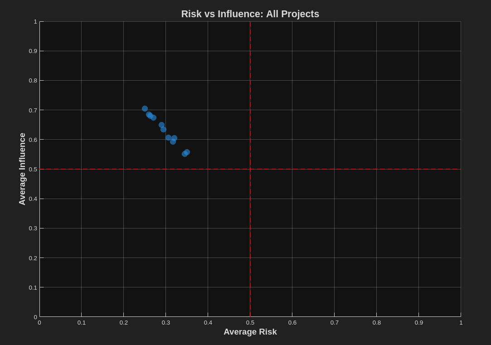
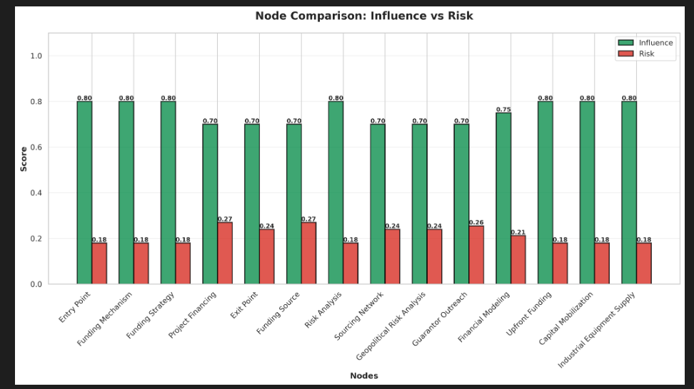

# Neuro-Symbolic Infrastructure Risk Analysis

AI-powered risk analysis for infrastructure consulting firms. Determines bid viability by mapping firm capabilities against project dependency graphs using cross-encoder similarity and agent-driven discovery.

This project represents a synthesis of Traditional Graph Theory (symbolic, deterministic) and Neuro-Symbolic Agentic Intelligence (probabilistic, contextual). By mapping a Firm's capabilities against a Project's DAG topology, we can move beyond simple risk matrices to a dynamic, multi-hop risk assessment.

## Quick Start

```bash
# Install dependencies
uv sync

# Set API key
export OPENAI_API_KEY="sk-proj-your-key-here"

# Start server
./run.sh
# or
uv run litestar run --reload

# Server runs at http://localhost:8000
# API docs at http://localhost:8000/schema/swagger
```

**Testing**: 264 tests, 100% passing
```bash
uv run pytest tests/ -v
```

## Primary Objectives

The system focuses on two critical pillars of infrastructure analysis:

1.  **Risk Profiling**: Determining the Strategic Alignment and Operational Risk between a Firm Object (the Bidder/Consultant) and a Project Object (the Infrastructure DAG).
2.  **Dependency Mapping & Propagation (Critical)**: Identifying nodes most critical to project success and those that pose systemic risks to the firm. The system predicts and visualizes how a failure in a single upstream node propagates down the chain, potentially blocking entire project routes.

By traversing the project dependencies, the system classifies every node into a 2x2 Risk-Influence Matrix, identifying manageable tasks, critical dependencies, and potential deal-breakers.

## The Methodology: Agents & Cross-Attention

We utilize DSPy-powered Agents to perform "Context-Aware Traversal." Unlike a standard Breadth-First Search (BFS), our agents use Cross-Attention to weight the importance of nodes based on the intersection of Firm and Project attributes.

### Logical End-to-End Flow

The system processes data through the following pipeline:

1.  **Data Ingestion**: Loading `firm.json` (bidder portfolio) and `project.json` (infrastructure requirements) into our Entity models.
2.  **Topological Construction**: Initializing the `Graph` object and building the DAG where each node is enriched with embeddings from the entity's attributes.
3.  **Agentic Weighting (DSPy)**: 
    *   Deploying the **Extractor Agent** to pull deep context from project requirements and country-specific registries.
    *   Using the **Evaluator Agent** with a BGE-M3 Cross-Encoder to perform "Cross-Attention" between the Firm’s Query and the Node’s Key, generating a raw Influence Score ($I_n$).
4.  **Graph Traversal & Propagation**: 
    *   Navigating the DAG to find all paths/chains from the primary project entry point.
    *   The **Propagator Agent** applies the mathematical formulas from `risk.py` to calculate the Cascading Risk Score ($R_{total}$) across every downstream dependency.
5.  **Risk Evaluation & Network Analysis**:
    *   Performing graph-theoretic analysis to identify "Critical Chains"—sequences of tasks that, if failed, block the entire project.
    *   Calculating centrality and clustering coefficients to identify high-influence nodes and potential systemic risks.


6.  **Matrix Output**: Mapping findings to the 2x2 Action Matrix to determine Strategic Actions (Mitigate, Automate, Contingency, Delegate).

### Dependency & Inference Deployment

For the "Cross-Attention" weighting, we utilize the **BGE-M3 Cross-Encoder** (Re-ranker) via a high-performance inference container.

## Mathematical Framework

### A. Influence Score (I_n)

The influence a firm has over a node n is calculated by the cosine similarity between the Firm's capability vector (F) and the Node's requirement vector (R), scaled by the node's Centrality in the DAG.

$$I_n = (\frac{\vec{F} \cdot \vec{R}}{\|\vec{F}\| \|\vec{R}\|}) \times EigenCentrality(n)$$

### B. Cascading Risk Score (R_total)

We use a Product of Success formula to determine the risk of a node n based on its parents (pa):

$$P(Success_n) = (1 - P(Failure_{local})) \times \prod_{i \in pa(n)} P(Success_i)$$

## The Output: The 2x2 Action Matrix

The system maps eve
ry node n into one of four quadrants for the Consultant/Bidder:

| Quadrant | Risk vs. Influence | Description | Strategic Action |
| :--- | :--- | :--- | :--- |
| **Q1: Known Know
ns** | High Risk, High Influence | Complex tasks where the firm has deep expertise. | **Mitigate**: Direct oversight and custom workflows. |
| **Q2: The "No Biggie"** | Low Risk, High Influence | Routine tasks that the firm excels at. | **Automate**: Use standard operating procedures. |
| **Q3: The "Cooked" Zone** | High Risk, Low Influence | Critical project dependencies outside the firm's control. | **Contingency**: Buy insurance or demand legal indemnification. |
| **Q4: The Basic Shit** | Low Risk, Low Influence | Minor peripheral tasks. | **Delegate**: Subcontract or monitor minimally. |

## The I/O Contract (Proof of Concept)

To ensure the system provides actionable insights and rich visualizations, we follow a strict I/O contract:

### 1. Ingestion (Input)
We use standardized JSON payloads for the **Firm** (bidder) and **Project** (requirements):
- **`firm.json`**: Portfolio data including regional footprint, sector expertise, and service offerings.
- **`project.json`**: Infrastructure DAG requirements, including topological constraints, budget/timeline bounds, and entry/exit criteria.

### 2. Intelligent Output (Client-Centric Insights)
The system returns a high-value **Analysis Output Object** designed for both automated dashboards and strategic advisory:

- **Risk Tensors**: Raw PyTorch tensors representing the multi-dimensional distribution of risk across the topological manifold.
- **Critical Failure Chains**: Identified sequences of dependent nodes where a single failure propagates a non-recoverable project state.
- **Pivotal Linchpins**: High-importance nodes that have the highest mathematical weight in determining downstream project integrity.
- **Stress-Test Spreads**: Simulations showing the gap between the **Optimal Path** and the **Systemic Worst-Case**.

This makes it a "Decision Support Engine" rather than a simple data visualizer, providing the Firm with the exact levers they need to pull to secure project success.

## Implementation Architecture

*   **Primitives (base.py)**: The ground-truth metadata (ISO Country codes, Sector enums).
*   **Entities (entities.py)**: The "Firm" and "Project" objects—our data containers.
*   **Topology (graph.py)**: The DAG structure where nodes hold embeddings of the entities.
*   **Inference Layer (agents.py)**: DSPy agents performing the cross-attention weighting and traversal.

**Note on Network Analysis**: We use graph-theoretic metrics like centralities and clustering coefficients to evaluate the dependency structure, allowing the system to identify high-influence nodes and potential systemic risks across different sectors.

## What It Does

Analyzes whether a consulting firm should bid on an infrastructure project by:
1. Building a firm-specific dependency graph with cross-encoder weighted edges
2. Discovering missing nodes for capability gaps using AI agents
3. Evaluating each task for importance and firm influence
4. Classifying tasks into strategic quadrants (Mitigate/Automate/Contingency/Delegate)
5. Detecting critical failure chains
6. Providing actionable recommendations with confidence scores

## Key Features

- **REST API**: Production-ready Litestar API with OpenAPI 3.1 specification
- **BGE-M3 Cross-Encoder**: Firm-specific edge weighting and similarity scoring
- **DSPy Agents**: Context-aware evaluation and discovery using OpenAI models
- **Risk Propagation**: Mathematical risk cascading through dependency chains
- **Critical Chain Detection**: Identifies single points of failure
- **MATLAB Integration**: Full REST API integration with MATLAB frontend support
- **Comprehensive Testing**: 264 tests covering all components
- **Docker Ready**: Complete containerization with docker-compose

## Architecture

### Three-Layer System

**Layer 1: Cross-Encoder Foundation** (Fast)
- BGE-M3 reranker calculates firm-node similarity
- Generates firm-specific edge weights
- Detects capability gaps (low-weight edges)
- Formula: `weight = sigmoid(similarity) × 0.9^distance`

**Layer 2: Agent Discovery** (Creative)
- DSPy + OpenAI agents discover missing nodes for gaps
- Triggered when edge weight < 0.3
- Injects nodes to bridge capability gaps

**Layer 3: Evaluation & Analysis** (Strategic)
- DSPy agents evaluate importance/influence per node
- Risk calculation: `risk = importance × (1 - influence)`
- Critical chain detection via graph traversal
- Matrix classification into four strategic quadrants

## I/O Contract

### Input

**firm.json** - Bidder portfolio:
```json
{
  "id": "firm_001",
  "name": "ABC Engineering",
  "countries_active": [{"name": "Kenya", "a2": "KE", "a3": "KEN", "num": "404"}],
  "sectors": [{"name": "Transport", "description": "Roads, railways"}],
  "services": [{"name": "Engineering", "category": "Technical", "description": "Design"}],
  "strategic_focuses": [{"name": "Sustainability", "description": "Green infrastructure"}],
  "preferred_project_timeline": 24
}
```

**project.json** - Infrastructure requirements:
```json
{
  "id": "proj_001",
  "name": "Highway Construction",
  "country": {"name": "Kenya", "a2": "KE", "a3": "KEN", "num": "404"},
  "sector": "Transport",
  "service_requirements": ["Engineering", "Construction Management"],
  "timeline": 36,
  "ops_requirements": [
    {"name": "Design", "category": "Technical", "description": "Highway design"},
    {"name": "Construction", "category": "Execution", "description": "Build highway"}
  ],
  "entry_criteria": {
    "pre_requisites": ["Funding approval"],
    "mobilization_time": 3,
    "entry_node_id": "entry"
  },
  "success_criteria": {
    "success_metrics": ["Highway operational"],
    "mandate_end_date": "2027-12-31",
    "exit_node_id": "exit"
  }
}
```

### Output

**AnalysisOutput** - Comprehensive risk assessment:
```json
{
  "status": "success",
  "analysis": {
    "node_assessments": {
      "node_1": {
        "influence": 0.85,
        "risk": 0.35,
        "reasoning": "High firm capability, moderate external dependencies"
      }
    },
    "action_matrix": {
      "mitigate": ["node_3"],
      "automate": ["node_1", "node_2"],
      "contingency": ["node_5"],
      "delegate": ["node_4"]
    },
    "critical_chains": [{
      "chain_id": "chain_entry_to_exit",
      "nodes": ["entry", "node_1", "node_2", "exit"],
      "aggregate_risk": 0.45
    }],
    "summary": {
      "overall_bankability": 0.75,
      "average_risk": 0.25,
      "recommendations": [
        "Project is highly bankable - proceed with standard controls",
        "Prioritize mitigation for 1 high-risk nodes"
      ]
    }
  }
}
```

## API Usage

### Start Server

```bash
# Using run script
./run.sh

# Or directly
uv run litestar run --reload
```

### Analyze Project

```bash
curl -X POST http://localhost:8000/analyze \
  -H "Content-Type: application/json" \
  -d '{
    "firm_path": "src/data/poc/firm.json",
    "project_path": "src/data/poc/project.json",
    "budget": 100
  }'
```

### Interactive API Documentation

Open http://localhost:8000/schema/swagger for full interactive API docs.

## Project Structure

```
florent/
├── src/
│   ├── main.py                  # REST API (Litestar)
│   ├── models/                  # Data models (Firm, Project, Graph)
│   ├── services/
│   │   ├── agent/              # DSPy agents & orchestration
│   │   ├── math/               # Risk formulas
│   │   └── clients/            # AI & cross-encoder clients
│   └── settings.py             # Configuration
├── tests/                       # 264 comprehensive tests
├── docs/
│   ├── API.md                  # REST API reference
│   ├── SETUP.md                # Developer setup guide
│   ├── INDEX.md                # Documentation index
│   └── openapi.json            # OpenAPI 3.1 specification
├── scripts/
│   ├── generate_openapi.py     # OpenAPI spec generator
│   └── visualize_analysis.py   # Result visualization
├── MATLAB/                      # MATLAB integration
├── docker/                      # Docker configurations
├── update.sh                    # Build & test script
└── run.sh                       # Start server script
```

## Testing

**264 tests, 100% passing** (updated test coverage with enhanced schemas)



```bash
# Run all tests
uv run pytest tests/ -v

# Run specific module
uv run pytest tests/test_api.py -v

# With coverage
uv run pytest --cov=src --cov-report=html

# Using update script (runs tests + linting + OpenAPI generation)
./update.sh
```

## Docker Deployment

```bash
# Build and run (includes API + BGE-M3 model)
./run.sh

# Or using docker-compose
docker compose -f docker/docker-compose-api.yaml up --build

# Just the BGE-M3 model
docker compose -f docker/docker-compose-model.yaml up
```

## Recent Enhancements

- **Enhanced Schemas**: Updated data models for improved validation and flexibility
- **MATLAB Integration**: Updated MATLAB codebase to handle new JSON structures from backend
- **Test Coverage**: Expanded to 264 comprehensive tests covering all components
- **Documentation**: Streamlined documentation focusing on core concepts and practical usage
- **API Improvements**: Production-ready REST API with full OpenAPI 3.1 support

## Configuration

The system uses environment variables for configuration:

```bash
# Required
OPENAI_API_KEY=your_key_here

# Optional
LLM_MODEL=gpt-4o-mini              # OpenAI model to use
LOG_LEVEL=INFO                      # Logging level
USE_CROSS_ENCODER=true              # Enable BGE-M3 cross-encoder

# See docs/API.md for all configuration options
```

## Performance

- Small project (20 nodes): <1s
- Medium project (50 nodes): <2s
- Test suite (264 tests): ~3s
- Memory usage: <500MB
- Cross-encoder inference: ~10ms per edge
- DSPy evaluation: ~500ms per node

## Documentation

### Core Documentation
- **[README](README.md)** - This file (project overview)
- **[API.md](docs/API.md)** - REST API reference with examples
- **[SETUP.md](docs/SETUP.md)** - Developer setup guide
- **[INDEX.md](docs/INDEX.md)** - Documentation index

### Integration
- **[MATLAB Setup](MATLAB/SETUP.md)** - MATLAB integration guide
- **[OpenAPI Spec](docs/openapi.json)** - Auto-generated API specification

### Reference
- **[ROADMAP.md](docs/ROADMAP.md)** - Mathematical foundations and algorithms

## MATLAB Integration

The project includes full MATLAB integration support:

```matlab
% Load schemas
schemas = load_schemas();

% Create API request
json_str = create_analysis_request('firm.json', 'project.json', 100);

% Send to API
options = weboptions('RequestMethod', 'post', 'MediaType', 'application/json');
response = webwrite('http://localhost:8000/analyze', json_str, options);

% Process results
bankability = response.analysis.summary.overall_bankability;
```

See [MATLAB/SETUP.md](MATLAB/SETUP.md) for complete integration guide.

## Contributing

1. Fork the repository
2. Create a feature branch (`git checkout -b feature/amazing-feature`)
3. Make your changes
4. Run tests (`uv run pytest tests/ -v`)
5. Commit your changes (`git commit -m 'Add amazing feature'`)
6. Push to the branch (`git push origin feature/amazing-feature`)
7. Open a Pull Request

## License

See LICENSE file for details.

---

**Version**: 1.1.0
**Status**: Production Ready (264 tests, 100% passing)
**Last Updated**: 2026-02-08