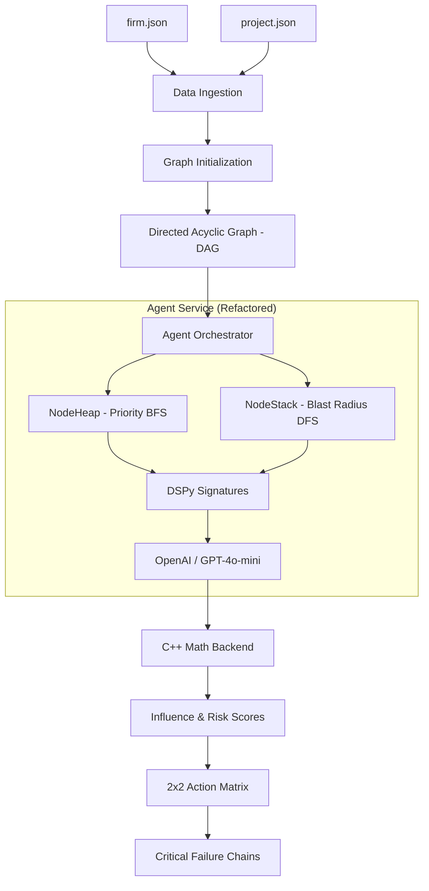

# Project Florent: System Audit & Architecture

## Overview
Project Florent is a neuro-symbolic engine designed for infrastructure risk analysis. It bridges deterministic graph theory (for dependency mapping) with probabilistic agentic intelligence (for contextual risk assessment).

## Programmatic Flow
The system follows a strict hierarchy from ingestion to strategic output.

## System Components

### 1. Primitives & Entities (`models/`)
- **`graph.py`**: Implements the base `Node` and `Edge` objects. Includes an iterative DFS cycle detector to ensure the project remains a DAG.
- **`entities.py`**: (In development) Standardized containers for Firm and Project metadata.

### 2. Core Logic (`services/agent/`)
- **`core/`**: 
    - `orchestrator.py`: The "Manual Control Loop." Manages the Stack/Heap without using high-level agent frameworks.
    - `traversal.py`: Implements custom LIFO (Stack) and Priority Queue (Heap) for specialized graph exploration.
- **`models/`**:
    - `signatures.py`: DSPy signatures that define the "shape" of the inputs/outputs for the LLM.
- **`ops/`**:
    - `tensor_ops.cpp`: High-performance C++ implementation of similarity and risk propagation formulas.
    - `tensor_ops_cpp.py`: Python bridge using `ctypes`.

### 3. Infrastructure
- **`main.py`**: A **Litestar** REST server providing an `/analyze` endpoint for both raw JSON and file-path references.
- **`Makefile`**: Automated build system for the C++ shared library.
- **`Dockerfile`**: Multi-stage containerization that separates the build environment from the lean runtime.

## Identified Gaps & Missing Features

1.  **Graph Centrality**: The current `Node` model lacks `EigenCentrality` calculation, which is a key component of the $I_n$ (Influence Score) formula.
2.  **Inference Deployment**: While the server is ready, the integration with the `BGE-M3 Cross-Encoder` container for raw similarity weighting is still handled via mocks.
3.  **Real-world Ingestion**: We need a robust "Loader" service to map arbitrary `project.json` files into the `Graph` object.
4.  **Critical Chain Detection**: The orchestrator has placeholders but needs the full "All-paths" search algorithm to identify systemic failure routes.
5.  **Output Tensors**: The server returns summary stats; it needs to return raw PyTorch tensors as specified in the original I/O contract.

## Strategic Roadmap
- **Step 1**: Finalize the $I_n$ formula with real centrality.
- **Step 2**: Implement the "Blast Radius" DFS logic in the orchestrator.
- **Step 3**: Integrate with the cross-encoder inference container.
- **Step 4**: Build the "Stress-Test Spread" simulator.
